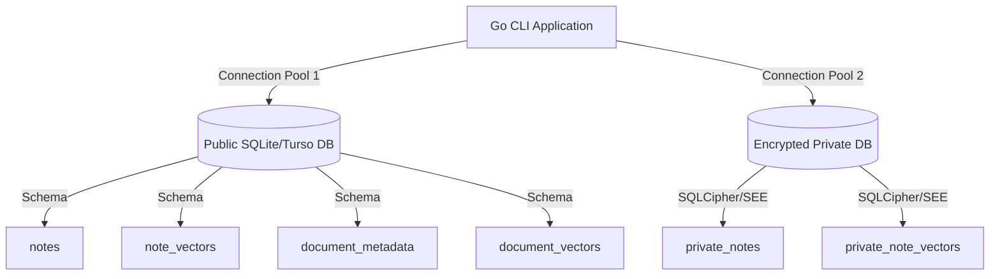

# Vector Database Schema & GORM Models Implementation

This document specifies the architecture, schemas, and GORM models for the vector databases used in the agentic workflow system. It details the integration of **TursoDB (libSQL)** vector search, local development deployments, encrypted databases for private data, and GORM custom serialization.

---

## 1. Vector Database Architecture & GORM Integration

The vector database layer stores high-dimensional semantic embeddings (e.g., 768-dimensional vectors from embedding models such as `embeddinggemma`) alongside text chunks and metadata. This layer is built to be wire-compatible with **TursoDB (libSQL)** vector search.

### Native libSQL Vectors
Turso/libSQL natively supports vector embeddings through the `F32_BLOB` column type and vector functions (e.g., `vector_cosine_similarity` or other distance functions). In libSQL, vectors are stored as a binary blob of 32-bit floating-point numbers (IEEE 754 float32) in little-endian byte order.

### GORM Custom Type: `Float32Vector`
To map Go's `[]float32` slices to libSQL `F32_BLOB` columns without manual conversion steps, we use a custom Go type `Float32Vector`. This type implements GORM/database driver interfaces:

- **`driver.Valuer`**: Automatically serializes `[]float32` to a binary byte array (`[]byte`) or JSON string.
- **`sql.Scanner`**: Deserializes the database value back into a `[]float32` slice, supporting both binary blob formats and JSON text fallbacks.

```go
type Float32Vector []float32

// Value converts the slice into a JSON-marshaled string/bytes for the database
func (v Float32Vector) Value() (driver.Value, error) {
	if v == nil {
		return nil, nil
	}
	bytes, err := json.Marshal(v)
	if err != nil {
		return nil, fmt.Errorf("failed to marshal float32 vector: %w", err)
	}
	return string(bytes), nil
}

// Scan converts the database value (JSON string/bytes) back into a Go slice
func (v *Float32Vector) Scan(value interface{}) error {
	if value == nil {
		*v = nil
		return nil
	}
	var bytes []byte
	switch data := value.(type) {
	case []byte:
		bytes = data
	case string:
		bytes = []byte(data)
	default:
		return fmt.Errorf("unsupported data type for Float32Vector: %T", value)
	}
	return json.Unmarshal(bytes, v)
}
```

When defining GORM structs, the embedding column specifies the database type explicitly using GORM tags:
```go
Embedding Float32Vector `gorm:"type:F32_BLOB(768)"`
```

---

## 2. TursoDB Local Deployment & Replication

The database is built on **libSQL / Turso** to support both local development and distributed cloud databases.

### Local Development Server
For local development, we run a local libSQL server using the Turso CLI:
```bash
turso dev
```
This runs the local `sqld` instance, typically listening on `http://127.0.0.1:8080`.

To configure our Go application to connect to this local Turso instance, we set the following environment variables:
```bash
export TURSO_DATABASE_URL="http://127.0.0.1:8080"
export TURSO_AUTH_TOKEN="" # Optional or empty for local
```

The [db/db.go](file:///Users/lemusi/VSProjects/agents/db/db.go) initialization logic automatically routes connections:
* **Remote/Local Server**: If `TURSO_DATABASE_URL` is set, it opens a connection via the `libsql` driver:
  ```go
  sqlDB, err := sql.Open("libsql", dsn)
  ```
* **Direct File Fallback**: If empty, it falls back to a direct SQLite file path (e.g., `local.db`).

---

## 3. Encrypted Vector Database for Private Data

To protect sensitive user information—specifically **private notes** and their corresponding **vector embeddings**—the system implements a fully segregated database configuration.



### Encryption at Rest (SQLCipher)
Private notes and their vector indexes are stored in a dedicated database file (e.g., `private.db`) encrypted via **SQLCipher** (or SQLite Encryption Extension).
* **Initialization**: The connection requires a user-supplied password (passphrase) at startup.
* **Pragmas**: During connection setup, the database driver must authenticate by executing:
  ```sql
  PRAGMA key = 'user_defined_password';
  ```
* **DSN Configuration**: In GORM, this can be specified directly in the connection string DSN depending on the chosen driver extension:
  ```go
  // Example for sqlcipher-compatible driver
  privateDSN := "file:private.db?_pragma=key('user_defined_password')"
  privateDB, err := gorm.Open(sqlite.Open(privateDSN), &gorm.Config{})
  ```

This ensures that the private notes and their corresponding float32 vector blobs are entirely encrypted on disk and cannot be read without the runtime password.

---

## 4. Schemas & GORM Models

### A. Documents (Disk & Database)
Structured markdown files are saved as files on disk within the project's `data/` directory. The database keeps track of document registry, metadata, modifications, and vector chunks.

#### 1. Document Metadata (`document_metadata`)
This model registers file information, creation, tags, and checksums to detect modifications.

```go
type DocumentMetadata struct {
	ID        uuid.UUID `gorm:"type:text;primaryKey"`
	FilePath  string    `gorm:"type:text;uniqueIndex;not null"` // e.g. "data/planner/HIGH_LEVEL_DESIGN.md"
	Title     string    `gorm:"type:text"`
	Checksum  string    `gorm:"type:text;not null"`             // SHA256 checksum of file contents
	CreatedAt time.Time `gorm:"type:datetime;not null;default:CURRENT_TIMESTAMP"`
	UpdatedAt time.Time `gorm:"type:datetime;not null;default:CURRENT_TIMESTAMP"`
	Tags      JSONTags  `gorm:"type:json"`                      // Custom tag list
}
```

#### 2. Document Vector (`document_vectors`)
Each document is split into semantic chunks for vector indexing. Each chunk references the parent document metadata record.

```go
type DocumentVector struct {
	ID         uuid.UUID     `gorm:"type:text;primaryKey"`
	ParentID   uuid.UUID     `gorm:"type:text;index;not null"`       // References document_metadata(id)
	ChunkIndex int           `gorm:"type:integer;not null"`          // Ordered position in document
	Chunk      string        `gorm:"type:text;not null"`             // Extracted markdown text
	Embedding  Float32Vector `gorm:"type:F32_BLOB(768);not null"`    // 768-dim float32 vector
	Tags       JSONTags      `gorm:"type:json"`                      // Inherited or generated tags
	CreatedAt  time.Time     `gorm:"type:datetime;not null;default:CURRENT_TIMESTAMP"`
}
```

---

### B. Unstructured Notes (Public)
Public shorthand logs and thoughts are stored directly in the database (rather than on disk).

#### 1. Note (`notes`)
Stores public logs, shorthand thoughts, and tags.

```go
type Note struct {
	ID        uuid.UUID `gorm:"type:text;primaryKey"`
	Note      string    `gorm:"type:text;not null"`
	CreatedAt time.Time `gorm:"type:datetime;not null;default:CURRENT_TIMESTAMP"`
	Tags      JSONTags  `gorm:"type:json"`
}
```

#### 2. Note Vector (`note_vectors`)
Stores the corresponding chunk embeddings for unstructured notes.

```go
type NoteVector struct {
	ID        uuid.UUID     `gorm:"type:text;primaryKey"`
	ParentID  uuid.UUID     `gorm:"type:text;not null;index"`       // References notes(id)
	Chunk     string        `gorm:"type:text;not null"`             // Note content slice
	Embedding Float32Vector `gorm:"type:F32_BLOB(768);not null"`    // 768-dim float32 vector
	Tags      JSONTags      `gorm:"type:json"`
}
```

---

### C. Private Notes (Encrypted Database)
Private notes and their vector indexes exist solely within the password-encrypted SQLite database. They mirror the structure of public notes but are housed in separate schemas.

#### 1. Private Note (`private_notes`)
Stores private shorthand logs, sensitive observations, and tags.

```go
type PrivateNote struct {
	ID        uuid.UUID `gorm:"type:text;primaryKey"`
	Note      string    `gorm:"type:text;not null"`
	CreatedAt time.Time `gorm:"type:datetime;not null;default:CURRENT_TIMESTAMP"`
	Tags      JSONTags  `gorm:"type:json"`
}
```

#### 2. Private Note Vector (`private_note_vectors`)
Stores semantic embeddings for private notes.

```go
type PrivateNoteVector struct {
	ID        uuid.UUID     `gorm:"type:text;primaryKey"`
	ParentID  uuid.UUID     `gorm:"type:text;not null;index"`       // References private_notes(id)
	Chunk     string        `gorm:"type:text;not null"`
	Embedding Float32Vector `gorm:"type:F32_BLOB(768);not null"`    // 768-dim float32 vector
	Tags      JSONTags      `gorm:"type:json"`
}
```
